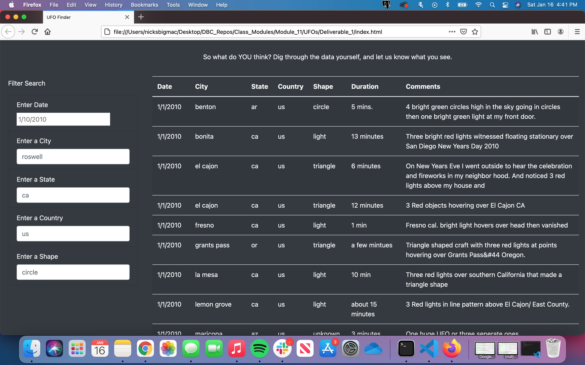

# UFO Webpage

## Background and Overview

During the asynchronous part of the module , the webpage and dynamic table were working as intended but unfortunately it was not too in depth. So I was tasked with creating a more in depth analysis of UFO sightings. More in Depth meaning that I was tasked in creating a site that allowed users to fikter for multiple criteria at the same time. For example being able to filter by city,date, state, country and shape.

## Results

So the way the site works is fairly simple, when it is first loaded up it is completely unfiltered. You have the ability to look through every single entry. 

### Unflitered

 

After seeing the unfiltered page , we can then take a look at the filtered page below where we were able to filter by Date, City, State, Country and even Shape of the sighting.

### Filtered

 

## Summary (Flaws)

* This site could be far more efficient in that there is no "clear" button that would reset all outputs so if you wanted to filter different factors back to back it would make it far more efficient and user friendly.

* If there was a way to simply input longitude / latitude I believe that could bring this to the next level because say if someone was curious about an unmarked area like Area 51, they could simply look up the coordinates and get the informations

* Also if there was a way to simply put "my location" that way if someone were traveling, they could simply drop their pin and get all the information they are looking for !
